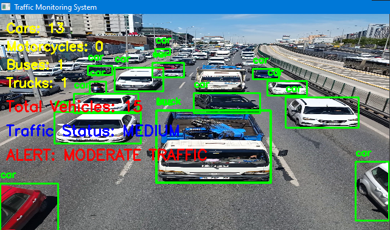
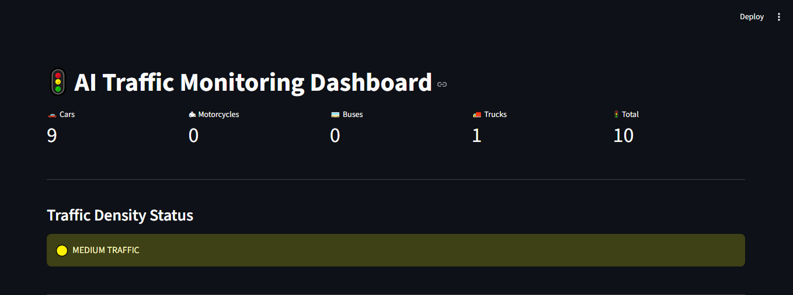
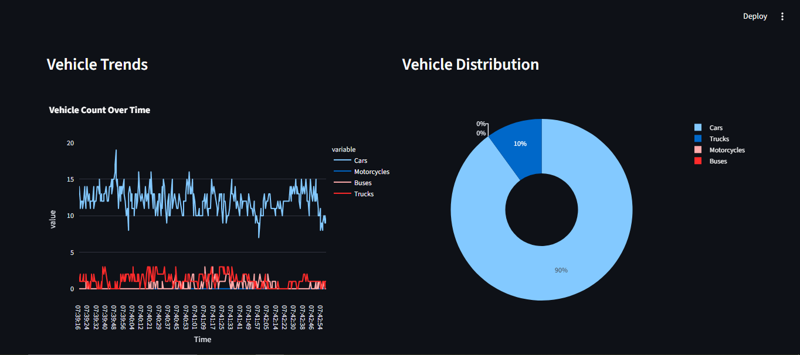
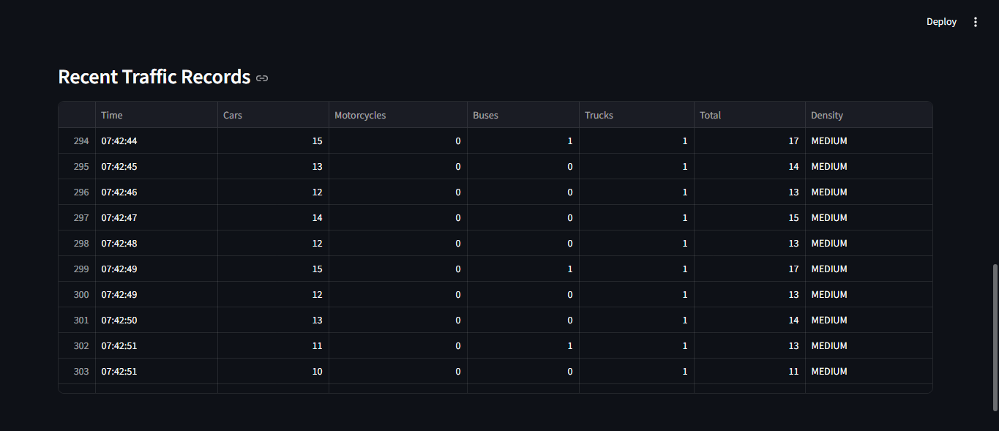

# AI Traffic Monitoring System

## Project Demonstration

### Vehicle Detection System

### Dashboard Overview

### Analytics Dashboard

### Traffic Records

## Overview

An intelligent traffic monitoring and analytics system developed using YOLOv8, OpenCV, Python, and Streamlit.

The system performs real-time vehicle detection, classification, traffic density estimation, and data analytics from traffic video streams.

This project demonstrates practical applications of:

- Artificial Intelligence
- Computer Vision
- Data Analytics
- Smart Traffic Monitoring
- Intelligent Transportation Systems

## Key Features

- Real-Time Vehicle Detection using YOLOv8
  
- Vehicle Classification
  - Cars
  - Motorcycles
  - Buses
  - Trucks
    
- Traffic Density Analysis
- Traffic Congestion Monitoring
- Interactive Streamlit Dashboard
- Data Visualization and Analytics
- Traffic Records Storage using CSV

## Technologies Used

- Python
- YOLOv8
- OpenCV
- Streamlit
- Pandas
- NumPy

## Applications

- Smart City Traffic Management
- Intelligent Transportation Systems
- Urban Traffic Analysis
- Traffic Congestion Monitoring
- AI-Based Surveillance Systems
